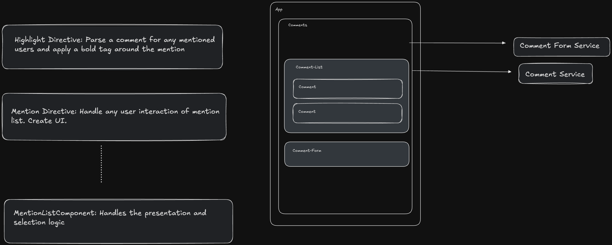

# TaggedComments

This project was generated with [Angular CLI](https://github.com/angular/angular-cli) version 18.2.1.

## Development server

Run `ng serve` for a dev server. Navigate to `http://localhost:4200/`. The application will automatically reload if you change any of the source files.

## Test Users

| Name  |
|-------|
| Luke  |
| Darth |
| Leia  |
| Han   |
| Yoda  |

## To-do's and Future Enhancements

- [ ] Position dropdown list right above the text area
- [ ] Add the ability to change what the denotation character is (currently it is @)
- [ ] Write unit test for existing code
- [ ] Add the ability to pass a custom template to the dropdown
- [ ] Improve the accessibility of the dropdown

## Sketch

